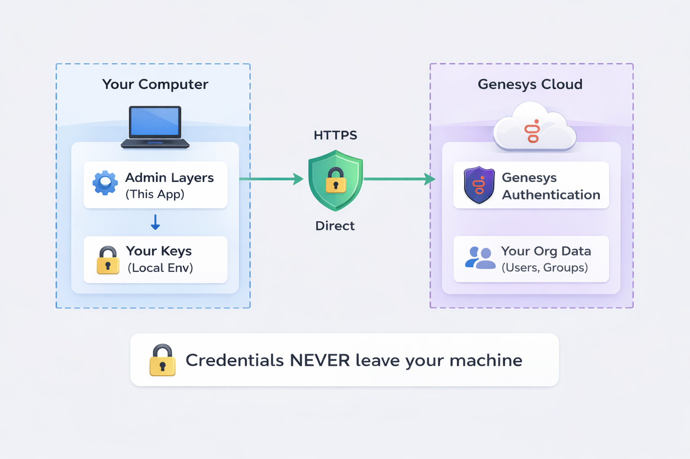

<div align="center">

# Admin Layers

<a href="docs/images/adminlayer-infographic.png">
  
</a>

**Bulk admin tools for Genesys Cloud with encrypted storage and demo mode**

[](https://opensource.org/licenses/MIT)
[](https://www.python.org/downloads/)
[](https://streamlit.io)
[](https://github.com/adminlayers/admin-layers)

[Website](https://adminlayers.com) | [Documentation](https://github.com/adminlayers/docs) | [Report Issues](https://github.com/adminlayers/admin-layers/issues)

</div>

---

## The Problem

Managing Genesys Cloud through the web UI is:

- **Slow** - Adding 500 users to a group takes hours of clicking
- **Risky** - No preview, no undo, no safety net
- **Tedious** - Repetitive tasks that should be automated

## The Solution

Admin Layers is a Streamlit-based utility suite that connects directly to Genesys Cloud APIs. Run it locally or deploy to Streamlit Community Cloud. All credentials are encrypted at rest.

```
┌────────────────────────────────────────────────────────────────┐
│  Admin Layers                              ◉ Demo Mode        │
├──────────┬─────────────────────────────────────────────────────┤
│          │                                                     │
│ ⚙ Admin  │  Welcome to Admin Layers                           │
│  Layers  │                                                     │
│          │  ┌─────────────────┐  ┌─────────────────┐          │
│ ──────── │  │ 🔑 Connect to   │  │ ⚡ Try Demo      │          │
│          │  │    Your Org     │  │    Mode          │          │
│ 🏠 Home  │  │                 │  │                  │          │
│          │  │ Use your OAuth  │  │ Explore with     │          │
│ ──────── │  │ credentials     │  │ sample data      │          │
│          │  └─────────────────┘  └─────────────────┘          │
│ 👥 Group │                                                     │
│  Manager │  Available Utilities                                │
│          │  ┌──────────┐ ┌──────────┐ ┌──────────┐           │
│ 🎯 Skill │  │👥 Group  │ │🎯 Skill  │ │📞 Queue  │           │
│  Manager │  │  Manager │ │  Manager │ │  Manager │           │
│          │  │  [Open]  │ │  [Open]  │ │  [Open]  │           │
│ 📞 Queue │  └──────────┘ └──────────┘ └──────────┘           │
│  Manager │                                                     │
│          │                                                     │
│ ──────── │                                                     │
│ 🔒 Stor- │                                                     │
│   age    │                                                     │
│ v1.1.0   │                                                     │
└──────────┴─────────────────────────────────────────────────────┘
```

---

## Key Features

| Feature | Description |
|---------|-------------|
| **Bulk Operations** | Add hundreds of users to groups, assign skills, manage queues in seconds |
| **Encrypted Storage** | All credentials encrypted at rest with Fernet (AES-128-CBC + HMAC-SHA256) |
| **Demo Mode** | Try the full interface with sample data — no credentials required |
| **Dry Run Mode** | Preview changes before executing. See the blast radius. |
| **Cloud Deployable** | Host on Streamlit Community Cloud with encrypted secrets |
| **Modular Design** | Use what you need. Extend with your own utilities. |
| **Import/Export** | CSV import, bulk export, seamless data movement |
| **Audit Trail** | Every operation logged locally with rollback data |

---

## Quick Start

### Option 1: Try Demo Mode (No Credentials)

```bash
git clone https://github.com/adminlayers/admin-layers.git
cd admin-layers
pip install -r requirements.txt
streamlit run app.py
```

Click **"Launch Demo"** on the home page to explore with sample data.

### Option 2: Connect to Your Org

```bash
# Set your credentials
export GENESYS_CLIENT_ID="your-client-id"
export GENESYS_CLIENT_SECRET="your-client-secret"
export GENESYS_REGION="mypurecloud.com"

# Start the application
streamlit run app.py
```

### Option 3: Deploy to Streamlit Community Cloud

1. Fork this repository
2. Go to [share.streamlit.io](https://share.streamlit.io)
3. Deploy `app.py` from your fork
4. Add secrets in the app settings:

```toml
# In Streamlit Cloud > App Settings > Secrets
encryption_key = "your-strong-encryption-key"

[genesys]
client_id = "your-client-id"
client_secret = "your-client-secret"
region = "mypurecloud.com"
```

The app opens at `http://localhost:8501` (local) or your Streamlit Cloud URL.

---

## Available Modules

| Module | Description | Status |
|--------|-------------|--------|
| **Group Manager** | View members, bulk add/remove by email or CSV, export | ✅ Available |
| **Skill Manager** | List skills, user lookup, bulk assign/remove with proficiency | ✅ Available |
| **Queue Manager** | View members, queue config, export, all-queues overview | ✅ Available |

---

## Demo Mode

Admin Layers includes a built-in demo mode with realistic sample data:

- **30 users** across Support, Sales, Engineering, QA, and HR departments
- **5 groups** (Tier 1 Support, Tier 2 Support, Sales Team, All Hands, Weekend Coverage)
- **5 queues** (General Support, Billing, Sales Inbound, Technical, VIP)
- **12 routing skills** with user assignments and proficiency levels

All operations (add, remove, assign) succeed in demo mode without side effects. This makes it possible to explore the full UI on a hosted deployment without real credentials.

```
┌──────────────────────────────────────────────────────────┐
│ ⚡ Demo Mode — Exploring with sample data. No real       │
│   Genesys Cloud connection. Connect with real            │
│   credentials to manage your org.                        │
├──────────────────────────────────────────────────────────┤
│                                                          │
│  Group Manager                                           │
│  ┌────────────────────────────────────────────────────┐  │
│  │ Tier 1 Support · 15 members                        │  │
│  │                                                    │  │
│  │  Name              Email                    ID     │  │
│  │  ─────────────     ───────────────────     ─────  │  │
│  │  Alice Johnson     alice.johnson@...       0000   │  │
│  │  Bob Martinez      bob.martinez@...        0001   │  │
│  │  David Chen        david.chen@...          0003   │  │
│  │  ...               ...                     ...    │  │
│  │                                                    │  │
│  │  Showing 15 members                                │  │
│  └────────────────────────────────────────────────────┘  │
└──────────────────────────────────────────────────────────┘
```

---

## Encrypted Storage

All sensitive data is encrypted at rest using **Fernet symmetric encryption** (AES-128-CBC with HMAC-SHA256).

### How It Works

| Component | Storage | Encryption |
|-----------|---------|------------|
| **Credentials** | Encrypted file or session state | Fernet (AES-128-CBC) |
| **Session Data** | Streamlit session state | Isolated per tab |
| **Action History** | Local JSON or session state | Plaintext (non-sensitive) |

### Encryption Key Priority

1. `st.secrets["encryption_key"]` — for Streamlit Community Cloud
2. `ADMIN_LAYERS_KEY` environment variable — for server deployments
3. Auto-generated per session — for local development

When a persistent key is configured, credentials survive across browser sessions. Otherwise, they are encrypted in memory for the current session only.

---

## Architecture

<div align="center">
<a href="docs/images/adminlayer-secure-diagram.png">
  
</a>
</div>

```
┌─────────────────────────┐          ┌──────────────────────┐
│   YOUR MACHINE / CLOUD  │          │   GENESYS CLOUD      │
│                         │          │                      │
│  ┌───────────────────┐  │  HTTPS   │  ┌────────────────┐  │
│  │   Admin Layers    │──┼──────────┼─>│ Your Org Data  │  │
│  │   (Streamlit)     │  │  Direct  │  │ (Users,Groups) │  │
│  └───────────────────┘  │          │  └────────────────┘  │
│         │               │          │                      │
│         ▼               │          └──────────────────────┘
│  ┌───────────────────┐  │
│  │ Encrypted Storage │  │  Credentials encrypted at rest
│  │ (Fernet AES-128)  │  │  with HMAC-SHA256 integrity
│  └───────────────────┘  │
└─────────────────────────┘
```

**Security Model:**
- Credentials encrypted at rest with Fernet (AES-128-CBC + HMAC-SHA256)
- Direct HTTPS API calls to Genesys Cloud (no proxy or middleware)
- No data passes through third-party servers
- Session isolation per browser tab
- Audit trail stored locally

---

## Project Structure

```
admin-layers/
├── app.py                  # Streamlit application entry point
├── requirements.txt        # Python dependencies
├── core/                   # Core modules
│   ├── __init__.py
│   ├── encrypted_storage.py # Fernet encryption for credentials & data
│   └── demo.py             # Demo mode with mock API and sample data
├── genesys_cloud/          # Genesys Cloud SDK
│   ├── __init__.py
│   ├── api.py              # API client with sub-APIs
│   ├── auth.py             # OAuth authentication
│   └── config.py           # Configuration (env, secrets, file)
├── utilities/              # Utility modules
│   ├── __init__.py
│   ├── base.py             # BaseUtility abstract class
│   ├── group_manager.py    # Group management utility
│   ├── skill_manager.py    # Skill management utility
│   ├── queue_manager.py    # Queue management utility
│   └── history.py          # Action history (filesystem + session)
├── .streamlit/
│   ├── config.toml         # Streamlit theme & server config
│   └── secrets.toml.example # Template for deployment secrets
├── setup.ps1               # Windows setup wizard
└── start.ps1               # Windows start script
```

---

## Creating Custom Utilities

Admin Layers is designed to be extensible. Create your own utilities by extending `BaseUtility`:

```python
from utilities import BaseUtility, UtilityConfig

class MyUtility(BaseUtility):
    @staticmethod
    def get_config() -> UtilityConfig:
        return UtilityConfig(
            id="my_utility",
            name="My Utility",
            description="Does something useful",
            icon="wrench",
            category="Custom"
        )

    def render_sidebar(self) -> None:
        # Add sidebar controls
        pass

    def render_main(self) -> None:
        # Render main content
        pass
```

Then register it in `app.py`:

```python
UTILITIES = {
    "my_utility": MyUtility,
    # ... other utilities
}
```

See `utilities/TEMPLATE.py` for a complete template.

---

## Configuration

### Credential Sources (Priority Order)

| Source | Use Case |
|--------|----------|
| Environment variables | Local development, CI/CD |
| `st.secrets["genesys"]` | Streamlit Community Cloud |
| Encrypted storage (UI) | Browser-based "remember me" |
| Config file (`config.json`) | Legacy local config |

### Environment Variables

| Variable | Required | Description |
|----------|----------|-------------|
| `GENESYS_CLIENT_ID` | Yes | OAuth Client ID |
| `GENESYS_CLIENT_SECRET` | Yes | OAuth Client Secret |
| `GENESYS_REGION` | No | Genesys region (default: `mypurecloud.com`) |
| `ADMIN_LAYERS_KEY` | No | Encryption key for persistent storage |

### Supported Regions

| Region | Domain |
|--------|--------|
| US East | `mypurecloud.com` |
| US West | `usw2.pure.cloud` |
| Canada | `cac1.pure.cloud` |
| EU Ireland | `mypurecloud.ie` |
| EU Frankfurt | `mypurecloud.de` |
| EU London | `euw2.pure.cloud` |
| Asia Pacific (Sydney) | `mypurecloud.com.au` |
| Asia Pacific (Tokyo) | `mypurecloud.jp` |
| Asia Pacific (Seoul) | `apne2.pure.cloud` |
| Asia Pacific (Mumbai) | `aps1.pure.cloud` |

---

## Streamlit Community Cloud Deployment

1. **Fork** this repository
2. Go to [share.streamlit.io](https://share.streamlit.io) and create a new app
3. Select your fork, branch `main`, and file `app.py`
4. In **Advanced Settings > Secrets**, add:

```toml
encryption_key = "generate-a-strong-key-here"

[genesys]
client_id = "your-client-id"
client_secret = "your-client-secret"
region = "mypurecloud.com"
```

Generate an encryption key:
```bash
python -c "from cryptography.fernet import Fernet; print(Fernet.generate_key().decode())"
```

If you omit the `[genesys]` section, the app starts in disconnected mode and users can enter credentials through the UI or launch demo mode.

---

## OAuth Client Setup

To use Admin Layers with a real Genesys Cloud org, you need an OAuth client with **Client Credentials** grant:

1. Go to **Genesys Cloud Admin** > **Integrations** > **OAuth**
2. Click **Add Client**
3. Set **Grant Type** to **Client Credentials**
4. Add required **Scopes** based on modules you'll use:
   - Groups: `groups`, `users:readonly`
   - Skills: `routing`, `users`
   - Queues: `routing:readonly`
5. Assign a **Role** with appropriate permissions
6. Save and copy the **Client ID** and **Client Secret**

---

## Contributing

Contributions are welcome! Please feel free to submit a Pull Request.

1. Fork the repository
2. Create your feature branch (`git checkout -b feature/amazing-feature`)
3. Commit your changes (`git commit -m 'Add amazing feature'`)
4. Push to the branch (`git push origin feature/amazing-feature`)
5. Open a Pull Request

---

## License

This project is licensed under the MIT License - see the [LICENSE](LICENSE) file for details.

---

## Disclaimer

Admin Layers is not affiliated with, endorsed by, or sponsored by Genesys. Genesys Cloud is a trademark of Genesys Telecommunications Laboratories, Inc.

---

## Support

- [Website](https://adminlayers.com)
- [Documentation](https://github.com/adminlayers/docs)
- [Report Issues](https://github.com/adminlayers/admin-layers/issues)
- [Discussions](https://github.com/adminlayers/admin-layers/discussions)
